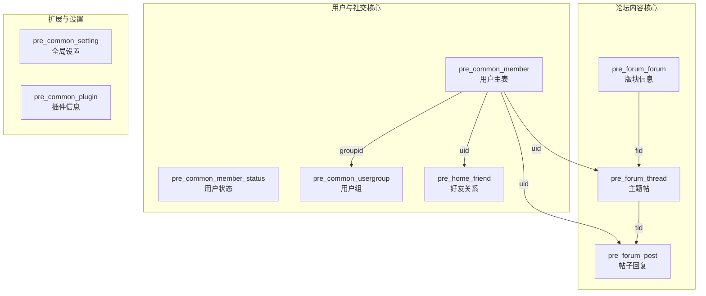

Discuz! X3.4的数据库结构较为复杂，并没有一个官方发布的完整、标准化的实体关系图（ER图）。不过，其表结构有清晰的命名规范，我们可以通过分析核心表及它们之间的关系来理解其数据库设计。

### 核心数据表分类与关系

整个数据库的表可以大致分为以下几个主要的功能模块，它们之间的核心关系如下图所示：

---

### 主要数据表详解

下面是一些最关键的数据表及其核心字段说明：

#### 1. 用户与社交模块
*   **`pre_common_member` （用户主表）**
    *   **`uid`** (主键): 用户唯一ID。
    *   **`username`**: 用户名。
    *   **`groupid`** (外键): 关联 `pre_common_usergroup` 表，定义用户权限。
*   **`pre_common_member_status` （用户状态表）**
    *   **`uid`** (主键， 外键): 与用户主表一对一关联，存储最后登录时间、IP等动态信息。
*   **`pre_home_friend` （好友关系表）**
    *   **`uid`** (外键): 用户ID。
    *   **`fuid`** (外键): 好友的用户ID。
    *   *关系*: 这是一个自关联关系，通过 `uid` 和 `fuid` 两个字段将 `pre_common_member` 表关联起来，表示多对多的好友关系。

#### 2. 论坛内容模块
*   **`pre_forum_forum` （论坛版块表）**
    *   **`fid`** (主键): 版块唯一ID。
    *   **`name`**: 版块名称。
    *   **`threads`**, **`posts`**: 版块内的主题数和帖子数统计。
*   **`pre_forum_thread` （主题帖表）**
    *   **`tid`** (主键): 主题帖唯一ID。
    *   **`fid`** (外键): 所属版块ID，关联 `pre_forum_forum` 表。
    *   **`authorid`** (外键): 发帖人ID，关联 `pre_common_member` 表。
    *   **`subject`**: 帖子标题。
*   **`pre_forum_post` （帖子内容表）**
    *   **`pid`** (主键): 帖子回复唯一ID。
    *   **`tid`** (外键): 所属主题ID，关联 `pre_forum_thread` 表。
    *   **`authorid`** (外键): 回帖人ID，关联 `pre_common_member` 表。
    *   **`message`**: 回复的详细内容。
    *   *关系*: 一个主题（`thread`）拥有多个回复（`post`），这是典型的一对多关系。

#### 3. 系统与扩展模块
*   **`pre_common_setting` （全局设置表）**
    *   以键值对（`skey`, `svalue`）形式存储全站配置，如站点名称、关闭开关等。
*   **`pre_common_plugin` （插件表）**
    *   存储已安装插件的信息。

### 如何获取更详细的信息？

由于没有官方ER图，你可以通过以下方式深入探查：

1.  **直接查看数据库**：在您自己的Discuz!站点数据库中，使用`SHOW CREATE TABLE [表名]`或`DESC [表名]`命令，可以查看最准确的表结构和字段注释（如果安装时保留了中文注释）。
2.  **查阅开发者资料**：在代码托管平台（如Gitee）上Discuz! X3.4的官方仓库中，`upload/install/data/`目录下的安装SQL文件（`install.sql`）是**最权威**的表结构定义来源。
3.  **参考社区整理文档**：一些技术社区（如“Discuz!实验室”或开发者博客）可能有爱好者整理的部分表结构说明，可以作为辅助参考，但需注意时效性。

如果你有具体想了解的模块（例如，积分系统、门户文章、 moderation 审核流程等）的表关系，我可以为你提供更聚焦的分析。