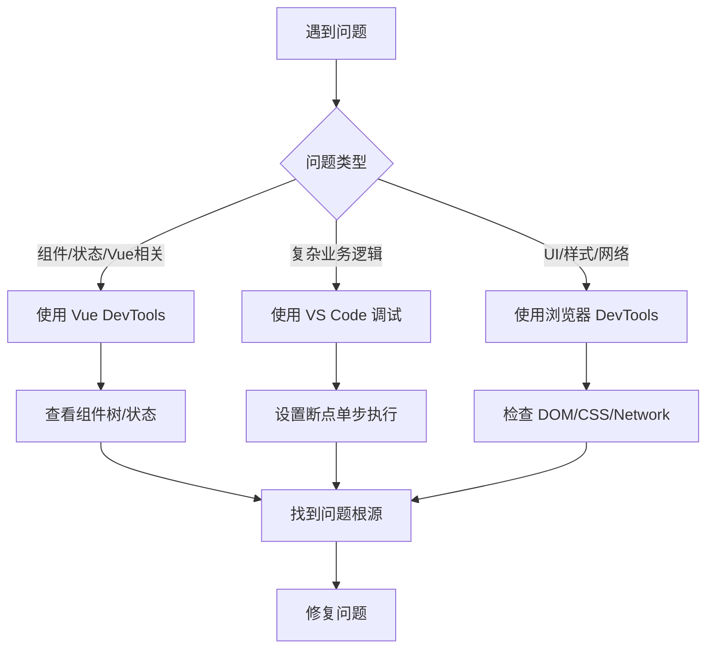

你说得对！对于 Vue 3 项目来说，**Vue DevTools 确实是调试的绝佳选择**。它提供了一些 VS Code 和浏览器原生调试器无法比拟的专属功能。

## 🚀 **Vue DevTools 不可替代的优势**

### **1. 可视化组件树**
```
DevTools 可以：
✓ 实时查看组件层级关系
✓ 点击组件直接跳转到代码
✓ 查看组件 props、emits、slots
✓ 快速定位组件位置
```

### **2. 状态管理调试**
```javascript
// Pinia/Vuex 状态管理
// DevTools 提供：
✓ 时间旅行调试 (Time Travel)
✓ 状态快照对比
✓ 状态变化追踪
✓ 直接编辑状态值
```

### **3. 性能分析**
```
性能面板：
✓ 组件渲染耗时统计
✓ 更新性能分析
✓ 内存泄漏检测
✓ 帧率监控
```

### **4. 事件追踪**
```vue
<!-- 清晰查看所有事件 -->
<button @click="handleClick">点击</button>
<CustomComponent @custom-event="handleCustom" />

// DevTools 会显示：
// - 事件触发时间线
// - 事件参数
// - 事件处理器
```

## 💡 **为什么 Vue DevTools 更香**

### **场景1：快速定位组件问题**
```vue
<!-- 假设有一个渲染问题 -->
<template>
  <TodoList>           <!-- DevTools 直接看到这个组件 -->
    <TodoItem v-for="todo in todos" />  <!-- 循环的子组件 -->
  </TodoList>
</template>

// 在 DevTools 中：
// 1. 直接看到 TodoList 组件
// 2. 展开查看所有 TodoItem
// 3. 点击检查每个组件的 props
// 4. 修改 props 值实时预览
```

### **场景2：状态管理调试**
```javascript
// 使用 Pinia
export const useTodoStore = defineStore('todos', {
  state: () => ({
    todos: [],
    filter: 'all'
  }),
  actions: {
    addTodo(text) {
      // DevTools 可以：
      // ✓ 看到状态变化时间线
      // ✓ 回退到之前的状态
      // ✓ 追踪哪个 action 触发了变化
    }
  }
})
```

### **场景3：性能优化**
```vue
<script setup>
// DevTools 性能面板会显示：
// - 这个组件渲染了 100 次 ❌
// - 每次渲染耗时 15ms ⚠️
// - 提示可能的优化方案 💡

const expensiveComputation = computed(() => {
  // 昂贵计算
})
</script>
```

## 🛠️ **Vue DevTools 高级用法**

### **1. 自定义检查器**
```javascript
// 创建自定义调试面板
import { addInspector } from '@vue/devtools-api'

addInspector({
  id: 'my-custom-inspector',
  label: '我的调试器',
  icon: '⚡',
  
  // 自定义 UI
  treeFilterPlaceholder: '搜索...',
  
  // 获取要显示的数据
  getInspectorTree(payload) {
    return [
      { id: 'node1', label: '自定义节点' }
    ]
  }
})
```

### **2. 状态编辑**
```
实时编辑功能：
1. 在 DevTools 中直接修改 state
2. 立即在页面看到效果
3. 无需重新编译或刷新
```

### **3. 组件高亮**
```
功能：
✓ 鼠标悬停组件高亮
✓ 点击组件定位 DOM
✓ 显示组件层级路径
```

### **4. 路由调试**
```javascript
// Vue Router 集成
// DevTools 显示：
✓ 当前路由路径
✓ 路由参数
✓ 导航历史
✓ 路由守卫触发
```

## 🔄 **各工具协同工作流**

### **我的推荐流程：**


### **具体协同示例：**
```javascript
// 1. 先用 Vue DevTools 定位问题组件
// 发现 TodoItem 组件渲染异常

// 2. 切换到 VS Code
// 在 TodoItem 组件中设置断点
const TodoItem = {
  props: ['todo'],
  setup(props) {
    debugger // 在这里暂停
    
    // 3. 检查 props 数据
    console.log('props:', props.todo)
    
    // 4. 修复问题后，用 DevTools 验证
  }
}

// 5. 用浏览器 DevTools 检查最终渲染效果
```

## 🎯 **什么时候用什么工具**

### **用 Vue DevTools：**
```
✅ 组件 props 传递问题
✅ 状态管理 (Pinia/Vuex) 调试
✅ 事件监听和触发
✅ 组件生命周期问题
✅ 性能分析和优化
```

### **用 VS Code 调试：**
```
✅ 复杂算法逻辑
✅ 数据转换和处理函数
✅ 需要单步执行的场景
✅ 结合代码编辑实时修改
```

### **用浏览器 DevTools：**
```
✅ CSS 样式问题
✅ DOM 结构检查
✅ 网络请求调试
✅ 移动端响应式测试
✅ 控制台快速测试
```

## 🚀 **Vue DevTools 实战技巧**

### **技巧1：组件搜索**
```
在 DevTools 中：
1. 按 Ctrl+F (Cmd+F)
2. 输入组件名
3. 快速定位到特定组件
```

### **技巧2：状态快照对比**
```javascript
// 保存两个时间点的状态
const snapshot1 = JSON.stringify(store.state)
// ...执行一些操作后
const snapshot2 = JSON.stringify(store.state)

// DevTools 可以直接比较差异
```

### **技巧3：性能监控**
```javascript
// 配合代码中的性能标记
import { perf } from 'vue'

perf.start('expensive-operation')
// 执行昂贵操作
perf.end('expensive-operation')

// DevTools 性能面板会显示计时
```

## 📊 **总结：Vue DevTools 的独特价值**

| 功能             | Vue DevTools | VS Code 调试 | 浏览器调试 |
| ---------------- | ------------ | ------------ | ---------- |
| **组件树可视化** | ✅ 原生支持   | ❌ 不支持     | ❌ 不支持   |
| **状态时间旅行** | ✅ 核心功能   | ❌ 不支持     | ❌ 不支持   |
| **Vue 性能分析** | ✅ 专门优化   | ⚠️ 有限支持   | ⚠️ 有限支持 |
| **事件追踪**     | ✅ 完整支持   | ❌ 不支持     | ⚠️ 部分支持 |
| **路由调试**     | ✅ 集成支持   | ❌ 不支持     | ❌ 不支持   |
| **直接编辑状态** | ✅ 实时编辑   | ❌ 不支持     | ❌ 不支持   |

## 💎 **最终建议**

**对于 Vue 项目，Vue DevTools 确实是首选工具**，特别是：

1. **日常开发**：80% 的时间用 Vue DevTools
2. **复杂逻辑**：配合 VS Code 断点调试
3. **样式/网络**：用浏览器 DevTools 补充

**最佳实践**：安装 Vue DevTools 扩展后，养成习惯：
- 按 `F12` 打开 DevTools
- 切换到 `Vue` 面板
- 使用组件树快速导航
- 利用时间旅行调试状态变化

**结论**：你说得对，Vue DevTools 提供了更针对 Vue 生态的调试体验，是 Vue 开发者必备的神器！其他调试工具可以作为补充，但 DevTools 确实是调试 Vue 应用的"第一选择"。