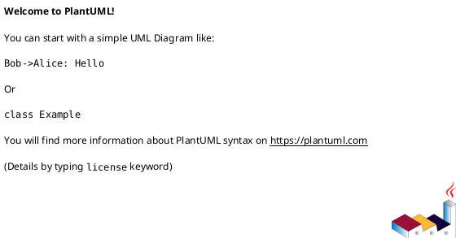

# PlantUML 语法速查手册

> PlantUML 是一种专为描述 UML 图与其他图表而设计的**领域特定语言（DSL）**。  
> 通过简洁的文本脚本即可生成高质量图表，无需拖拽绘图。

---

## 1. 脚本框架
每个文件必须以固定标记起止：



---

## 2. 注释
使用单引号 `'` 开始单行注释：

```plantuml
' 这是单行注释
```

---

## 3. 标题
为图表添加可视化标题：

```plantuml
title 我的系统架构图
' 图表内容
end title
```

---

## 4. 元素定义
| 元素类型 | 示例 |
|---|---|
| 参与者 | `actor 用户` |
| 用例 | `usecase "登录" as UC1` |
| 类 | `class MyClass { +void myMethod() -int myAttribute }` |

---

## 5. 关系语法
常用箭头一览：

| 符号 | 含义 | 示例 |
|---|---|---|
| `-->` | 普通关联 | `用户 --> UC1 : 执行` |
| `-->>` | 聚合/强关联 | `MyClass -->> AnotherClass : 继承` |

---

## 6. 皮肤参数
快速换色与统一风格：

```plantuml
skinparam class {
    BackgroundColor PaleGreen
    ArrowColor SeaGreen
}
```

---

## 7. 支持图表类型
- 顺序图（Sequence）
- 用例图（Use Case）
- 类图（Class）
- 活动图（Activity）
- 组件图（Component）
- 状态图（State）
- 更多…

> 各类型图表在基础语法之上拥有**专用扩展关键字**，  
> 详见 [官方文档](https://plantuml.com/zh/guide)。

---

## 8. 完整最小示例
```plantuml
@startuml
title 简易登录模块

actor 用户 as u
usecase "登录" as uc
class 登录控制器 {
  +login(username, password)
}

u --> uc : 触发
uc --> 登录控制器 : 调用
@enduml
```

保存为 `.puml` 文件后，使用 PlantUML 工具即可渲染成图。
```